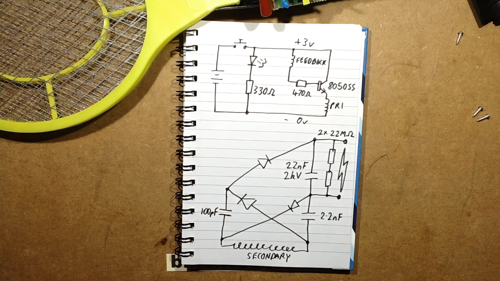

# Supercharged Zapper 🎾⚡
Open hardware project to "improve" the famous Aliexpress bug zapper

A favourite modification I like to do to bug zapping rackets is to rip out the AA battery terminals and replace them with a 9 volt battery terminal, and remove the discharge resistor. Depending on the model of racket, the hilt can either perfectly accomodate the new battery without modification, or with some mild coercion. However, due to the low cost nature of these things, longevity after the modification is highly variable, with some rackets lasting less than a few minutes, and some lasting for months on end. It seems like they'll use whatever transistor they can get their hands on from e-waste, and some rackets come with beefier transistors than others.

I have modified one racket to accept a large transistor from a PC power supply, which had to be remotely mounted off wires because it was too big to fit in the original component footprint on the PCB (let alone fit inside the hilt like that). This racket, along with its larger than average main capacitor, is the most powerful boosted racket I own. Naturally, I want all my rackets to be this reliable and powerful, and I'd like to do so with a custom PCB and maybe a 3D printed hilt. While we're at it, improve some more things along the way.

Planned features:
- Custom PCB featuring a transistor footprint that can comfortably house a very large transistor
- "Safety" slide switch that engages the discharge resistor in one position, disengages it in the other, and allows to press the slider engaging a tact switch underneath to power the racket
- An auto-stop circuit that prevents unnecessary battery drain? (This one might be difficult due to the output stage being such high voltage)

Since the racket face itself is quite simple to make, a smaller version with a finer wire pitch for midge is also desirable. Most midge are too small to bridge the wire pitch on the standard size racket.

Original schematic courtesy of [bigclivedotcom](https://www.youtube.com/watch?v=vvXZM6kg_gI)

